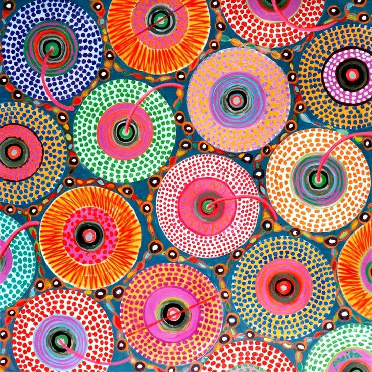

# IDEA9103_ Quiz 8

## Part 1: Imaging Technique Inspiration

My inspiration comes from the Superellipse Grid artwork on OpenProcessing and Pacita Abad’s Heels Fortune. The Superellipse Grid uses geometric repetition to create a clean, dynamic pattern, while Abad’s work inspires me with its vivid colors and rhythm. For my major assignments, I plan to combine these two ideas by using the grid structure as a base and turning each superellipse into simple particle. This will produce a lively, colorful visual effect that connects traditional art with generative design.

Example Images  

## Part 2: Coding Technique Exploration

To achieve the combination of the Superellipse Grid and Pacita Abad’s style, I will use p5.js. To achieve the combination of the Superellipse Grid and Pacita Abad’s style, I will use p5.js. In addition, I will incorporate random color functions and a simple particle system to add dynamic, colorful, and organic effects to the final visual.

[Link of the code](https://openprocessing.org/sketch/2685985)
